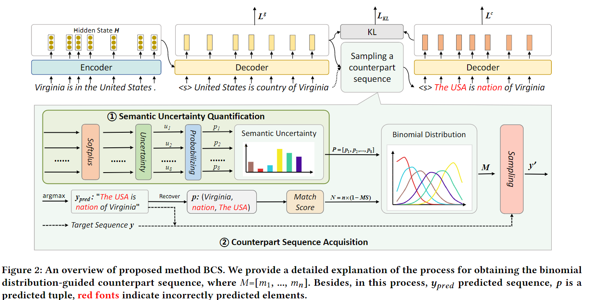
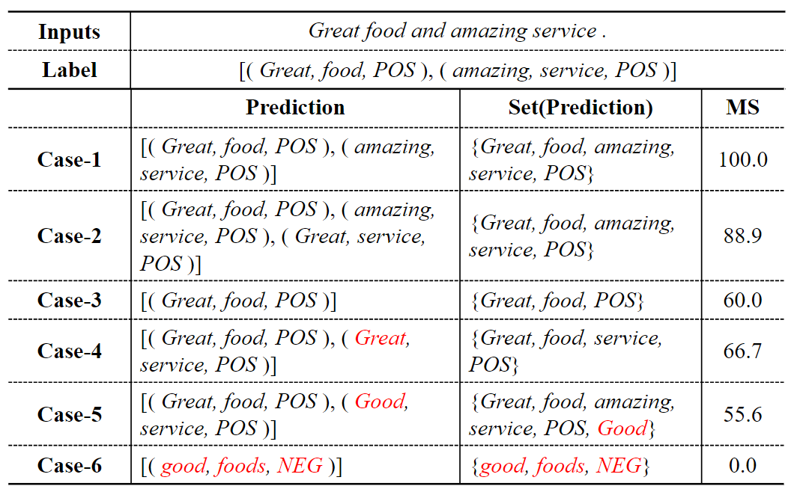
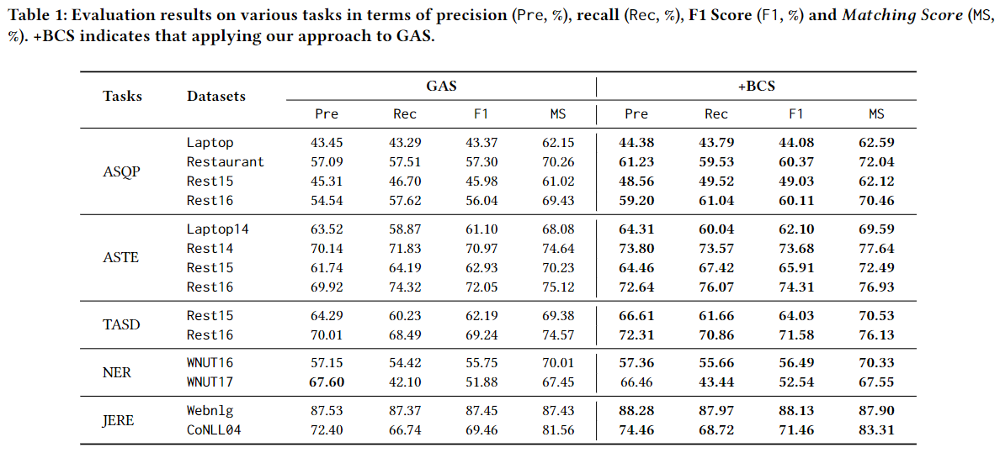
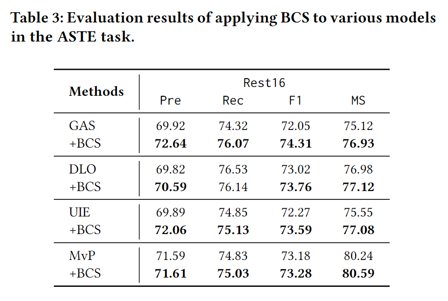

<h1 align="center">
Towards Robust Information Extraction via Binomial Distribution Guided Counterpart Sequence
</h1>

<p align="center">
  <a href="#-Introduction">Introduction</a> • 
  <a href="#-Results">Results</a> • 
  <a href="#-quick-start">Quick Start</a> • 
  <a href="#-Core-Code">Core Code</a>
</p>

## ✨ Introduction 

We improve IE LLMs from methods (BCS) and evaluation metrics (MS) respectively:

- BCS increases LLMs' understanding of tuples by allowing them to learn **semantic uncertainty**.


<p align="center">
    
</p>

- $Matching$ $Score$ is designed to **partially match tuples**, facilitating a more comprehensive assessment of the tuples generated by the model.

<p align="center">
    
</p>


## 🎯 Results

### Evaluation on Various Tasks
As shown in Table 1, the results on 14 public datasets across 5 tasks are reported. Firstly, it can be observed that +BCS improves the performance of the baseline on nearly all datasets and tasks:

<p align="center">
    
</p>


### Evaluation on Various Models
Results, as shown in Table 3, verify that BCS can be easily adopted in any generation-based framework and has universal effectiveness.

<p align="center">
    
</p>

## 🚀 Quick Start


### ⚙️ Setup

```sh
conda create -n bcs python=3.8
conda activate bcs
Python==3.8
torch==1.11.0
transformers==4.14.1
pytorch_lightning==0.8.1
numpy==1.21.2
```

### ⚡️ Training

- Train models:

```sh
bash scripts/run.sh  # process data
```

## 🤖 Core Code

### Matching Score

```
GAS+BCS/eval_utils.py: line 187
```

### BCS

obtain counterpart sequence
```
GAS+BCS/model.py: line 588
```

Semantic Alignment Loss
```
GAS+BCS/model.py: line 610
```

Total Loss
```
GAS+BCS/model.py: line 616
```

<!-- ## ☕️ Citation

If you find this repository helpful, please consider citing our paper:

```

``` -->
